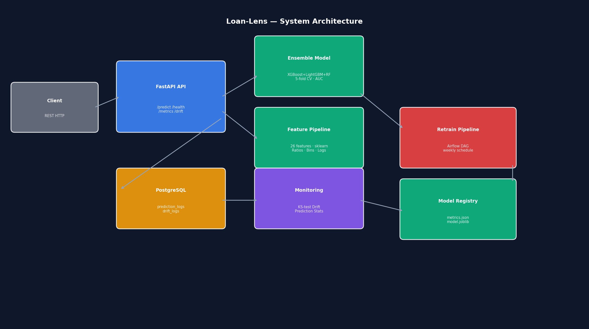

# Loan-Lens

[](https://github.com/atharvadevne123/Loan-Lens/actions/workflows/ci.yml)
[](https://python.org)
[](https://fastapi.tiangolo.com)
[](LICENSE)

**Credit risk scoring and loan default prediction API** powered by a LightGBM + XGBoost + RandomForest ensemble with SHAP explainability, KS-test drift monitoring, automated retraining, and Docker-backed PostgreSQL for production-grade lending risk assessment.

---

## Overview

Loan-Lens provides real-time credit risk assessment via a REST API. A three-model soft-voting ensemble is trained on 26 engineered features including debt-to-income ratios, FICO bucket encodings, log-transformed income, and interaction terms. Predictions are persisted to PostgreSQL and continuously monitored for distribution drift.

### Key Capabilities

| Feature | Detail |
|---|---|
| **Ensemble Model** | XGBoost + LightGBM + RandomForest (soft voting) |
| **5-Fold Cross-Validation** | AUC-ROC reported on training |
| **Feature Engineering** | 26 features: ratios, bins, log transforms, interactions |
| **Drift Detection** | KS-test per feature, automatic drift log |
| **Automated Retraining** | Airflow DAG (weekly) + standalone runner |
| **Prediction Logging** | Every request logged to PostgreSQL |
| **API Versioning** | `/api/v1/...` prefix on all endpoints |
| **Correlation IDs** | Every request/response tagged |

---

## Setup

### Prerequisites

- Python 3.11+
- Docker & Docker Compose

### Quick Start (Docker)

```bash
cp .env.example .env
docker-compose up --build
```

API available at http://localhost:8000

### Local Development

```bash
python -m venv .venv && source .venv/bin/activate
pip install -r requirements.txt
cp .env.example .env
uvicorn app.main:app --reload
```

### Run Tests

```bash
pytest tests/ -v --tb=short
```

### Lint

```bash
ruff check .
```

---

## API Reference

### POST `/api/v1/predict`

Score a loan application for default risk.

**Request Body:**

```json
{
  "loan_amount": 10000.0,
  "annual_income": 60000.0,
  "installment": 320.0,
  "interest_rate": 12.5,
  "loan_term_months": 36,
  "fico_score": 700,
  "revolving_utilization": 0.25,
  "revolving_balance": 5000.0,
  "delinquencies_2y": 0,
  "credit_history_months": 84,
  "open_accounts": 5,
  "total_accounts": 12,
  "public_records": 0
}
```

**Response:**

```json
{
  "correlation_id": "uuid-here",
  "probability": 0.1823,
  "prediction": 0,
  "risk_level": "low",
  "model_version": "1.0.0"
}
```

`risk_level`: `low` (p<0.4) · `medium` (0.4≤p<0.7) · `high` (p≥0.7)

---

### GET `/api/v1/health`

```json
{"status": "ok", "version": "1.0.0"}
```

### GET `/api/v1/metrics`

Returns model AUC, prediction count, default rate, percentile probabilities.

### GET `/api/v1/drift`

Returns KS-test drift results per feature, highlighting features with p < 0.05.

---

## Architecture



```
Client → FastAPI (CORS · Correlation-ID · Rate-limit)
       → Feature Pipeline (26 features · sklearn)
       → Ensemble Model (XGBoost + LightGBM + RF)
       → PostgreSQL (prediction_logs · drift_logs)
       → Monitoring (KS-test drift · stats)
       → Airflow DAG (weekly retrain)
```

---

## Project Structure

```
Loan-Lens/
├── app/
│   ├── __init__.py
│   ├── main.py          # FastAPI app + endpoints
│   ├── model.py         # Ensemble training & inference
│   ├── features.py      # Feature engineering pipeline
│   ├── monitoring.py    # Drift detection & logging
│   └── database.py      # SQLAlchemy models & session
├── pipelines/
│   └── retrain_dag.py   # Airflow DAG + standalone runner
├── tests/
│   ├── conftest.py
│   ├── test_api.py
│   ├── test_model.py
│   ├── test_features.py
│   └── test_monitoring.py
├── scripts/
│   └── generate_diagram.py
├── screenshots/
│   └── architecture.png
├── .github/workflows/ci.yml
├── Dockerfile
├── docker-compose.yml
├── requirements.txt
├── pyproject.toml
└── .env.example
```

---

## License

MIT License — see [LICENSE](LICENSE) for details.
